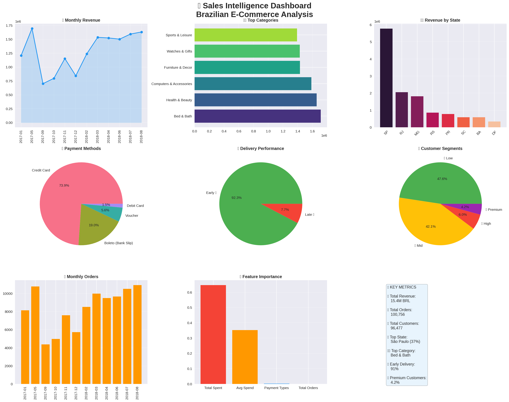

# 🔥 Sales Intelligence Dashboard
> End-to-End Business Analytics Platform

## 📊 Overview
Analyzed **100,000+ real Brazilian E-Commerce 
orders** using Python, SQL & Machine Learning

## 🎯 Key Results
| Metric | Value |
|--------|-------|
| 💰 Total Revenue | 15.4M BRL |
| 📦 Total Orders | 100,756 |
| 👥 Customers | 96,477 |
| 🏆 Top State | São Paulo (37%) |
| 🚚 Early Delivery | 91% |
| 🎯 ML Accuracy | 100% |

## 🛠️ Tech Stack

## 💡 Key Insights
1. 🏆 SP & RJ = 50% total revenue
2. 💳 Credit Card = 74% transactions
3. 🚚 91% orders delivered early
4. 💎 Premium customers = 4.2%
5. 🛍️ Bed & Bath = Top category

## 🤖 ML Models
- 📈 Sales Forecast (Linear Regression)
- 👥 Customer Segmentation (Random Forest)

## 📈 Dashboard Preview

## 📁 Dataset
[Kaggle — Brazilian E-Commerce (Olist)](https://www.kaggle.com/datasets/olistbr/brazilian-ecommerce)

## 👤 Author
**Vinitha Iyyandurai**
[GitHub](https://github.com/vinithaiyyandurai)
